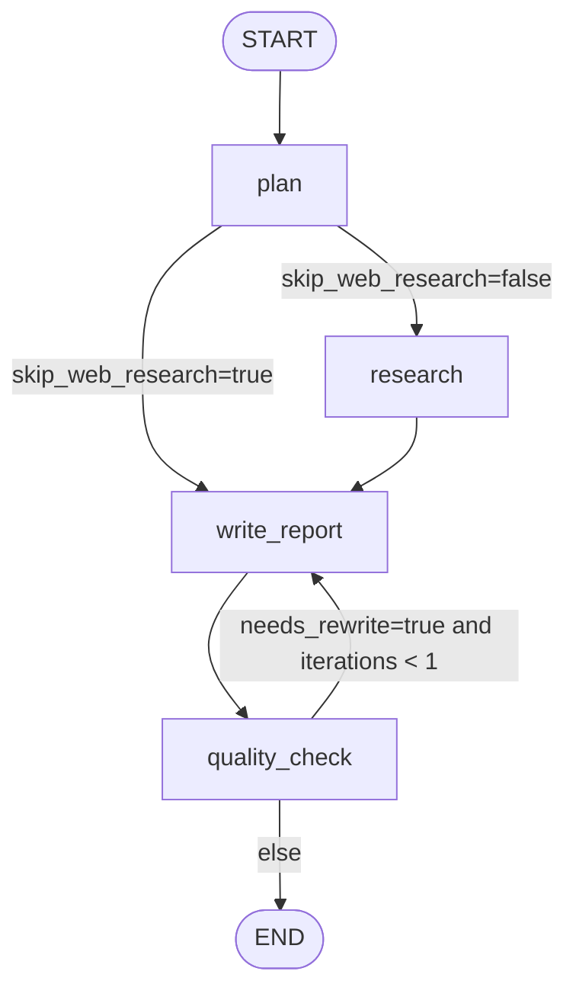

# Multi-Agent Deep Research System

## Deliverable 2: Architecture Document

### 1. System Architecture Diagram

```mermaid
flowchart LR
    U[User Browser UI] --> F[React + Vite Frontend]
    F -->|POST /chat (SSE)| API[FastAPI API Layer]

    API --> TS[Thread Store\nIn-memory by thread_id]
    API --> WF[LangGraph Workflow Engine]

    subgraph Agents
      P[Planner Agent]
      R[Research Agent]
      W[Writer Agent]
      Q[Quality Agent]
    end

    WF --> P
    WF --> R
    WF --> W
    WF --> Q

    R --> SR[Search Router]
    SR --> EXA[Exa Search API]
    SR --> FC[Firecrawl Search API]
    SR --> TV[Tavily Fallback API]

    W --> LLM[LLM Provider]
    P --> LLM
    Q --> LLM
    R --> LLM

    API --> SSE[SSE Event Stream]
    SSE --> F
```

Legend:
- `FastAPI API Layer`: request validation, SSE orchestration, workflow execution.
- `Thread Store`: history + report memories + shared memory, keyed by `thread_id`.
- `LangGraph Workflow Engine`: stateful node execution and conditional routing.
- `Search Router`: parallel Exa + Firecrawl, Tavily fallback only.

Data flow summary:
1. User sends query and optional `thread_id`.
2. API loads thread memory and starts workflow.
3. Planner decomposes query to sub-questions and search queries.
4. Research runs per sub-question, gathers evidence/citations.
5. Writer streams report chunks.
6. Quality evaluates report and can trigger one rewrite pass.
7. Final payload + citations + metadata emitted in `done`.

---

### 2. LangGraph Flow Diagram



State transitions:
- `plan`:
  - sets `state.plan`
  - sets `state.metadata.skip_web_research`
  - emits `planning` event with sub-questions
- `research`:
  - sets/merges `state.research_notes`
  - updates `state.citations`
  - appends `state.errors` for partial failures
- `write_report`:
  - sets `state.final_report`
  - streams `message` events
  - updates shared memory gaps context
- `quality_check`:
  - sets `state.quality`
  - sets `state.metadata.needs_rewrite`
  - can set `state.quality_feedback`
- End:
  - API emits `done`
  - persists history + report memory + shared memory

Decision points:
- `plan_router`: decides direct writer path for context-only follow-ups.
- `quality_router`: one bounded rewrite loop for report improvement.

---

### 3. Agent Design Decisions

#### Why this 3-agent architecture
Core split:
- Planner: decomposition, search intent shaping, sequencing.
- Researcher: retrieval, dedupe, evidence extraction, contradiction/gap detection.
- Writer: synthesis into structured final report.

Advantages:
- Lower prompt overload per agent.
- Better observability: each stage has isolated trace/log semantics.
- Easier iteration: retrieval quality can improve without rewriting writer logic.
- Stronger failure tolerance: research can degrade gracefully while writer still completes.

#### Alternatives considered
- 2-agent variant (`research + writer`):
  - Simpler but weaker decomposition and poorer sub-question coverage consistency.
- 4-agent variant (`planner + researcher + writer + validator/critic`):
  - Higher quality ceiling but more latency, complexity, and cost.
- Current approach:
  - 3 core agents + a bounded quality node for controlled refinement.

#### Trade-offs made
- Parallel research improves latency but can increase API burst and cost.
- One rewrite iteration improves quality but avoids unbounded loops.
- In-memory thread store enables fast dev/demo speed but no crash durability.
- Strong dedupe + caps reduce noisy sources but can under-cover niche topics if thresholds are too strict.

#### State management approach
State schema includes:
- Required: `query`, `plan`, `research_notes`, `final_report`, `citations`, `errors`.
- Operational: `thread_id`, `history`, `report_memories`, `shared_memory`, `metadata`, `runtime`.
- Quality/refinement: `quality`, `quality_feedback`, `refinement_used`.

Why this schema:
- Supports assignment-required contract and SSE progress model.
- Keeps memory coherent across agents via `shared_memory`.
- Preserves enough context for follow-up queries without exploding token usage.

---

### 4. Design Justifications

#### Key technical decisions
- SSE streaming for responsiveness (`thread_id`, `planning`, `research_progress`, `writing`, `message`, `done`, `error`).
- Search abstraction with provider router to avoid hard dependency on one API.
- Typed Pydantic models for request/response correctness.
- Async throughout for non-blocking IO and parallel research.

#### Why this workflow sequence
- `plan -> research -> write_report` reflects dependency order:
  - no meaningful research without decomposition
  - no coherent report without evidence aggregation
- Research runs concurrently per sub-question with bounded semaphore.

#### Error and edge handling
- Provider/API failures append to `state.errors`, emit SSE `error`, and continue with partial results.
- If writer/summary sub-step fails, fallback content generation still returns a report.
- Quota/cap limits prevent runaway usage within one workflow run.

#### Assumptions
- User wants broad but bounded research depth in one run.
- Thread continuity should be memory-assisted but still evidence-grounded.
- External APIs can fail independently; system must degrade gracefully.

#### Search stack rationale (Exa + Firecrawl + Tavily fallback)
Why Exa primary:
- Exa `/search` supports semantic search with direct text content extraction in one call, which is efficient for evidence bullets and citation grounding.
- Exa supports controls like `numResults`, domain filters, and search modes (`auto`, `fast`, `deep`) that map well to planner-generated query variants.

Why Firecrawl primary (parallel with Exa):
- Firecrawl `/search` can return both search metadata and scraped page content (markdown/html), improving snippet quality when Exa summaries are sparse.
- Firecrawl supports query operators (`site:`, `intitle:`, etc.) and location/time filters, useful for targeted and current-event research.

Why Tavily as fallback:
- Tavily provides robust search APIs with configurable `search_depth`, `max_results`, domain controls, and explicit usage/credits metadata.
- Tavily is used only when primaries fail or return nothing, reducing single-provider fragility while controlling costs.

Why this combination is better than one provider:
- Coverage diversity: different ranking/crawling systems reduce blind spots.
- Resilience: partial provider outage still returns results.
- Cost/latency control: route design can favor low-cost paths and fallback only when needed.

Implementation mapping in this codebase:
- `app/tools/web_search_router.py`: parallel Exa + Firecrawl merge, Tavily fallback.
- `app/agents/researcher.py`: scoring, dedupe, caps, and graceful degradation behavior.
- `app/config.py`: budget and retrieval constraints.

#### Shared memory rationale
Goal:
- Make the system behave like one coherent assistant across turns, not separate fragmented agents.

How it works:
- `shared_memory` is stored in graph state and persisted per `thread_id`.
- It combines recent messages, prior report summaries, and unresolved gaps.
- Planner reads shared memory to decide if web search can be skipped (`SKIP_WEB_RESEARCH`) for context-only follow-ups.
- Writer receives shared memory + history to answer follow-up/context questions while still preferring evidence-backed synthesis.

Why this design:
- Preserves continuity with bounded token footprint.
- Avoids brittle hardcoded follow-up logic.
- Keeps agents decoupled but context-synchronized.

---

## Production Readiness Plan

### 1. Persistence Strategy
- Replace in-memory thread store with:
  - `PostgreSQL` for durable thread history, report artifacts, audit trails.
  - `Redis` for short-term session cache, locks, and rate-limit counters.
- LangGraph checkpointing:
  - Persist node-level checkpoints after each stage (`plan`, `research`, `write_report`, `quality_check`).
  - Resume interrupted workflows using checkpoint + event replay.
- Storage tiers:
  - Long-term: prompts, final report, citations, quality score, errors.
  - Temporary: raw provider responses, transient streaming buffers.

### 2. Scaling Approach
- Horizontal API scaling behind load balancer (stateless app instances).
- Shared stores (Postgres/Redis) decouple memory from single process.
- Background execution:
  - Move long research runs to task workers (Celery/RQ/Arq) with job IDs.
  - Keep SSE gateway process for live event forwarding.
- Concurrent workflow controls:
  - per-user and global concurrency quotas
  - queue backpressure and timeout policies

### 3. Monitoring & Observability
- Metrics:
  - p50/p95/p99 latency by node and total workflow
  - success/failure rate
  - citation count, unique domains, quality pass rate
  - provider usage and cost per query
- Logging:
  - structured JSON logs with `thread_id`, `node`, `sub_question_id`, `provider`
  - correlation IDs across API + worker + provider requests
- Agent performance:
  - coverage score (sub-questions answered)
  - rewrite rate
  - partial-result completion rate

### 4. Error Handling & Reliability
- Retry strategy:
  - bounded exponential backoff for provider/LLM transient failures
- Circuit breakers:
  - disable provider temporarily on repeated 4xx/5xx or quota exhaustion
- Timeouts:
  - per-request and per-node hard time limits
  - graceful timeout messaging in report limitations

### 5. Rate Limiting & Cost Management
- Rate limiting:
  - per API key / org / user request limits (token bucket in Redis)
- Cost control:
  - query-level search call caps
  - rewrite loop max=1
  - dynamic reduction in queries/results under high spend
- Caching:
  - cache normalized search results by query hash + freshness window
  - cache citation metadata to avoid repeat provider calls

### 6. Security Considerations
- AuthN/AuthZ:
  - JWT/OAuth2 with tenant scoping
- Validation/sanitization:
  - strict request schemas, bounded input length, safe URL handling
- Secret management:
  - environment secrets from vault manager (not plaintext files in prod)
- Prompt-injection mitigation:
  - source-level sanitization, unsafe instruction stripping, citation-grounded output checks

### 7. Infrastructure Estimates

Assumptions:
- Average run: 1 plan + 4 sub-questions + 2 provider calls each + 1 writer + optional rewrite.
- Moderate streaming load and short report size.

`100 queries/day` (dev/small team):
- 1 API instance (2 vCPU, 4-8 GB RAM)
- 1 Postgres small instance
- 1 Redis small instance
- Estimated monthly infra: low hundreds USD range (excluding provider/LLM usage)

`10,000 queries/day` (production):
- 4-10 API instances autoscaled
- worker pool for research jobs
- managed Postgres (HA), Redis cluster
- centralized logs/metrics stack
- Estimated monthly infra: mid/high four-figure USD range (provider/LLM costs usually dominate)

Deployment recommendation:
- Containerized deployment via Docker + Kubernetes for scale.
- Start with Docker Compose for staging/small production.

---

## External References
- Exa Search API: https://exa.ai/docs/reference/search
- Exa Docs (overview/get started): https://exa.ai/docs
- Exa SDK spec (search options): https://exa.ai/docs/sdks/typescript-sdk-specification
- Firecrawl Search API v1: https://docs.firecrawl.dev/api-reference/v1-endpoint/search
- Firecrawl Search API v2: https://docs.firecrawl.dev/api-reference/endpoint/search
- Firecrawl search features: https://docs.firecrawl.dev/features/search
- Tavily Docs home: https://docs.tavily.com/
- Tavily Search API reference: https://docs.tavily.com/documentation/api-reference/endpoint/search
- Tavily search best practices: https://docs.tavily.com/documentation/best-practices/best-practices-search

---
